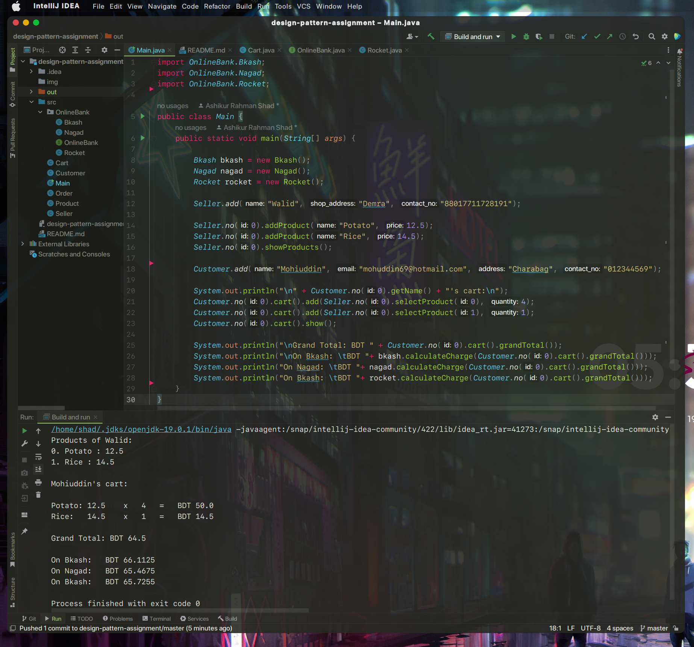

# design-pattern-assignment

IntelliJ Idea Project of my Design Pattern assignment: https://elearn.daffodilvarsity.edu.bd/mod/assign/view.php?id=1285314

**Question:** https://docs.google.com/document/d/1w9QOb0CsfhDaaOO3ORl3ApsBBRFTYPoV57ohqnlJIpU/edit

### Instruction A:

**IS-A relation exists between:**
Bkash, Nagad, and Rocket with OnlineBank
Bkash Is An Online Bank here.

**Has A relationships:**
1. A customer has a payment option
2. For payment, there is a Cart
3. A cart has some products
4. A seller has some products that he sells
5. etc
.

### Instruction B:

* Encapsulation done in all classes
* Polymorphism is used to set payment charge for different online banks
* OnlineBank interface is implemented in BKash, Nagad, Rocket

### Instruction C:

Link of the project in GitHub:
https://github.com/ashikur-rahman-shad/design-pattern-assignment

